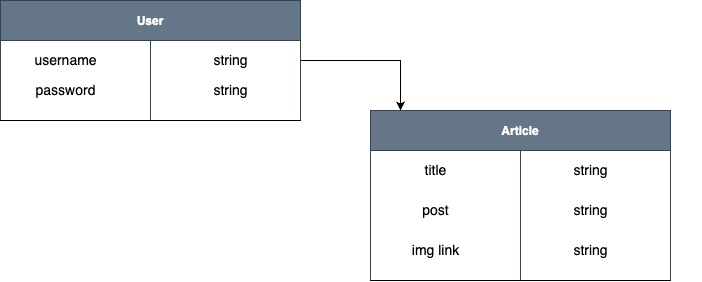
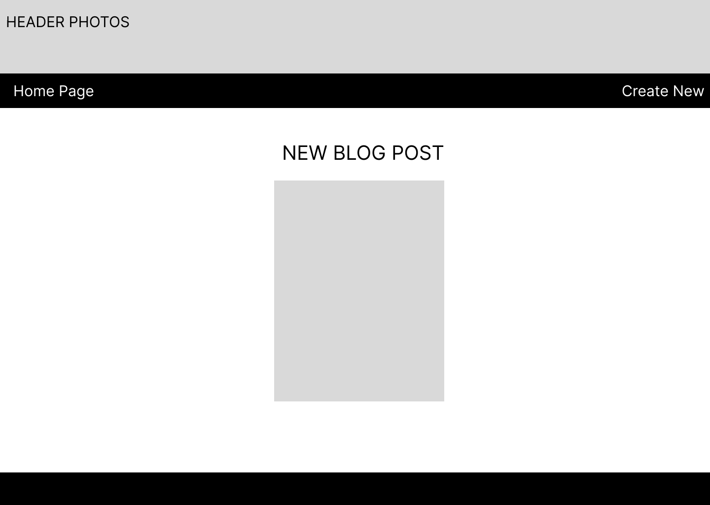
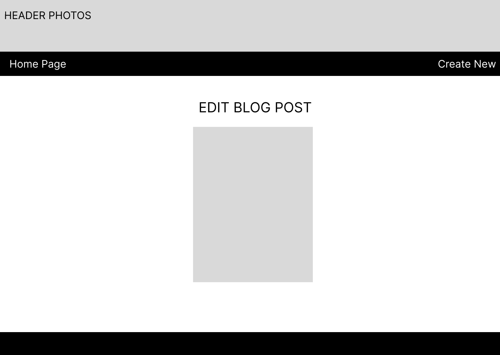
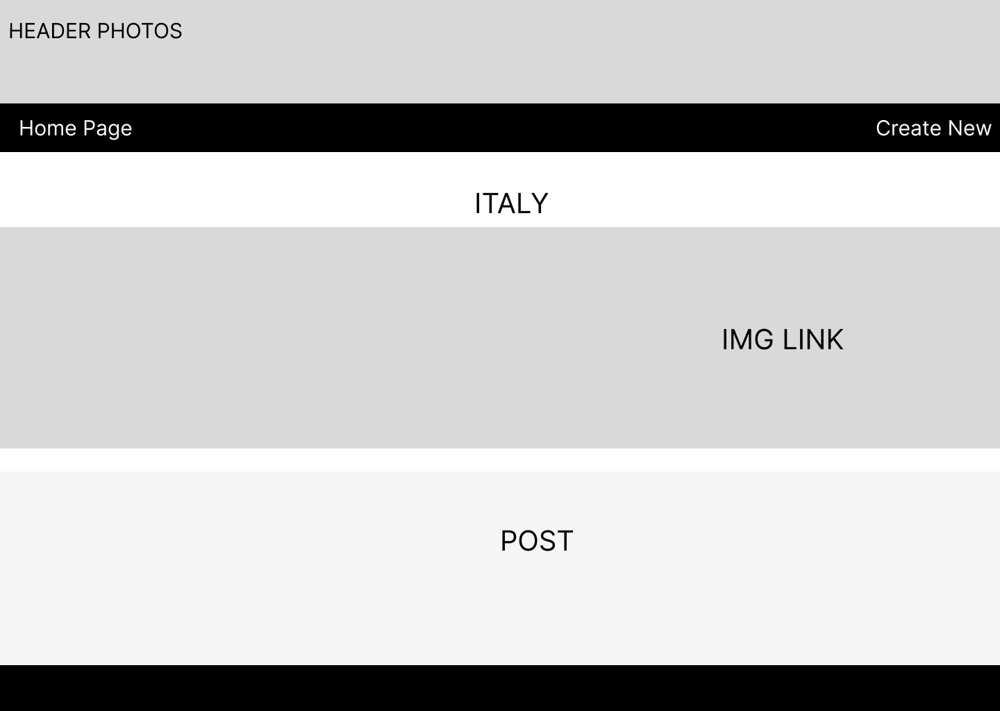

# Project 2: Travel Blog
 A CRUD app that is created for a user to be able to upload posts about past travels.

 # Technologies Used
JavaScript, HTML, CSS, Node.js, JSX, Express, Mongo.DB, mongoose

# Getting Started
link to app:

# Design

# Restful Routes:
Action | URL | HTTP Verb | JSX view filename | mongoose method 
--- | --- | --- | --- |--- 
Index | /articles/ | GET | Index.jsx | Article.find() | Article.find()
Show | /articles/:id/ | READ | Show.jsx | Article.findOne or Article.findById | 
New | /articles/new | GET | New.jsx | none | 
Create | /articles/ | POST | none | Article.create(req.body) | 
Edit | /articles/:id/edit | GET | Edit.jsx | Article.findOne or Article.findById | 
Update | /articles/:id | PUT | none | Article.findByIdAndUpdate or Article.findOneAndUpdate | 
Destroy | /articles/:id | DELETE | none | Article.findByIdAndRemove or Article.findByIdAndDelete | 

# ERD:

# Wireframes

# Next Steps
### Future Improvements
- Add in comments that logged in users can add
- Links that redirect to booking sites

